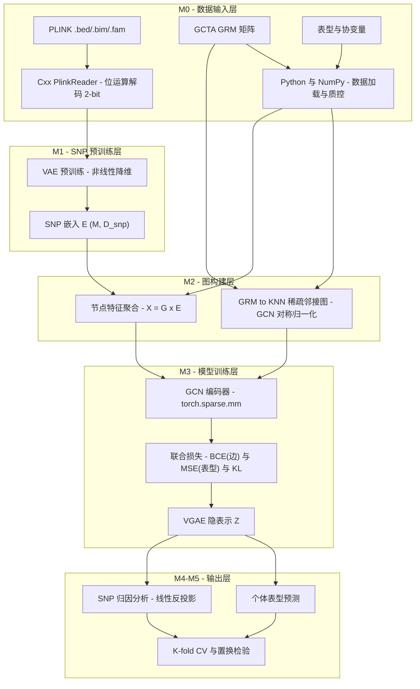

# SNP-VGAE

用基因型预测表型，同时告诉你哪些 SNP 在起作用。

做法是两阶段：先用 VAE 对 SNP 基因型做无监督压缩（也可以跳过这步，直接吃原始基因型），再基于 GRM 构建个体间的 KNN 图，用变分图自编码器（VGAE）同时做表型预测和图重建。预测之外，模型还支持 SNP 级归因，可以和 PLINK GWAS 的结果对照。

目前在小鼠 HS 群体上的最好成绩：Biochem.HDL 预测 R² = 0.22，是 GCTA-BLUP 基线的两倍；但 Haem.MCV 上反而不如 BLUP，详见"已知局限"。

## 快速开始

```bash
uv sync
export PYTHONPATH=$PWD/pytorch/src

# VAE 模式：先预训练 SNP 嵌入
uv run python test/test_real_data.py --epochs 200 --d-snp 64 --batch-size 512

# 无 VAE 模式：原始基因型直接进 VGAE，一步出预测 + 归因
uv run python test/predict_and_attribute_no_vae.py
```

单元测试：

```bash
uv run pytest test/test_pretrain.py test/test_build_graph.py test/test_vgae_model.py -v
```

环境：Python >= 3.13（uv 管理），PyTorch >= 2.12。MPS 后端和部分 PyG 操作有已知兼容性问题，建议跑 CPU 或 CUDA。

## 方法



四步走：

1. **SNP-VAE 预训练**：基因型矩阵过一遍变分自编码，每个 SNP 得到一个 64 维嵌入。KL 用 warmup，早停防塌缩。这一步可选——无 VAE 模式直接用插补后的原始基因型当节点特征。
2. **建图**：拿 GCTA GRM 建 K=30 的 KNN 稀疏图，节点是个体，边是亲缘关系，做 GCN 对称归一化。
3. **VGAE 训练**：GCN 编码器全部用 `torch.sparse.mm` 实现，不依赖 PyG。损失是 MSE（表型）+ BCE（边重建，带负采样）+ KL，端到端训。
4. **归因与验证**：编码器反投影算 SNP 归因分数；5 折交叉验证评估预测，置换检验给显著性，最后和 PLINK GWAS 对账。

两种输入模式：

| | VAE 嵌入模式 | 原始基因型模式 |
| --- | --- | --- |
| 入口 | `predict_and_attribute.py` | `predict_and_attribute_no_vae.py` |
| 节点特征 | G × E（9728 → 64 嵌入） | 插补后的原始基因型（9728 维） |
| 编码器 | 2 层 GCN，约 1.4 万参数 | 3 层渐进压缩 9728→512→128→16，约 505 万参数 |
| 正则 | dropout 0.5 | dropout 0.7 + 更大 weight decay + 早停 |

## 实验结果

基线是 GCTA-BLUP，5 折交叉验证，四个性状：

| 性状 | h² | N | BLUP R² | VGAE R² | 说明 |
| --- | --- | --- | --- | --- | --- |
| Biochem.HDL | 0.63 | 1,509 | 0.109 | **0.218** | 翻倍 |
| Biochem.ALP | 0.55 | 1,604 | 0.166 | **0.200** | +20.6% |
| End.Weight | 0.42 | 1,715 | -0.055 | **0.062** | BLUP 基线为负，提升率没法算 |
| Haem.MCV | 0.46 | 1,457 | **0.150** | 0.116 | 劣化 22.6% |

HDL 上的统计显著性：5×5 重复 CV 配对 t 检验 t = 8.36，p = 0.0011；置换检验下两者的真实 R² 都显著高于零分布。

### 原始基因型模式（无 VAE，Biochem.HDL）

跳过 VAE 预训练，原始基因型直接进 VGAE。和 BLUP 用同一套 5 折划分（seed=42，N=1,509）：

| 指标 | GCTA-BLUP | VGAE-noVAE |
| --- | --- | --- |
| R² | 0.112 | **0.207** |
| r | **0.502** | 0.456 |
| MSE | 0.146 | **0.131** |
| MAE | 0.297 | **0.282** |

几个值得注意的点：

- 精度和 VAE 模式（R² = 0.218 ± 0.032）基本打平，5 折的 R²/MSE 全部赢 BLUP——但 BLUP 的相关系数略高，逐样本比只有 52.4% 的样本我们误差更小。优势主要来自预测尺度的校准和位点级建模，不是每个个体都预测得更准。
- 两个模型的预测值相关只有 0.51，等权融合后 R² 到 0.301，说明抓到的信号互补。
- 归因出 475 个显著 SNP（聚成 167 个 locus），最强的在 chr5 rs13478144（|score| = 0.136，约是置换零分布均值的 12 倍）；chr4 ~134–136 Mb 有明显热点，Top-24 里占了 8 个。
- 和 GWAS 对账：GWAS 最强的 chr1 主效 QTL（p ≈ 1e-60）全部被识别，54.9% 的显著 SNP 落在 GWAS locus ±1 Mb 内。另外有 89 个位点是"线性盲区"——我们显著但 GWAS 在 ±500 kb 内连 nominal p < 0.01 都没有，chr7/chr13 成簇，怀疑是上位性效应，还没做成对交互检验（y ~ A + B + A×B），先别当结论用。
- 显著性阈值目前偏保守：只跑了 200 次置换，阈值实际取在 null 最大值附近，检出数被压低了，校正 p 值也全饱和成 1.0。后面会换成 95 分位 max-statistic 阈值 + BH-FDR，置换次数提到 1 万以上。

结果文件在 `test/result/Biochem.HDL_no_vae/`（predictions.tsv、snp_attribution.tsv、top_snps.tsv、model_summary.json）。

## 测试数据

`test_data/` 是小鼠 HS 群体数据集：

| 数据 | 文件 | 说明 |
| --- | --- | --- |
| 基因型 | `hs_mice_genome_QCed.bed/.bim/.fam` | PLINK 二进制，约 2,002 样本 × 9,728 SNP（QC 后子集） |
| GRM | `total_autosome_grm.grm.bin/.grm.id/.grm.N.bin` | GCTA 全常染色体关系矩阵 |
| 表型 | `phenotypes/*.resid` 等 | 200+ 生理/行为性状的残差化表型 |
| GWAS | `HDL_gwas.assoc.linear` | PLINK 线性回归结果，用于对账 |

## 项目结构

```
SNP-VGAE/
├── pytorch/src/          # Python 主体实现
│   ├── data/             # PLINK BED/BIM/FAM、GCTA GRM、表型、协变量解析
│   │   ├── genotype.py       # BED 位运算解码，返回 (M, N) 基因型矩阵
│   │   ├── grm.py            # GCTA .grm.bin / .grm.id 读取
│   │   ├── fam.py / bim.py   # FAM / BIM 读取
│   │   ├── pheno.py          # 表型（.resid）读取
│   │   └── covar.py          # 协变量读取
│   ├── pretrain/         # SNP-VAE 预训练与嵌入提取
│   │   ├── vae.py            # SNPVAE 模型与损失
│   │   ├── preprocess.py     # 基因型预处理与标准化
│   │   ├── train.py          # 训练流水线（KL warmup + 早停）
│   │   └── extract_embeddings.py
│   ├── graph/            # 样本图构建
│   │   └── build_graph.py    # KNN 图 + GCN 对称归一化 + 节点特征聚合
│   ├── model/            # VGAE 模型与归因
│   │   ├── gcn.py            # GCNConv（纯稀疏矩阵运算）
│   │   ├── vgae.py           # VGAEModel：编码器 + 边解码器 + 预测头
│   │   ├── vgae_non_vae.py   # VGAENoVAE：原始基因型模式
│   │   └── attribution.py    # SNP 级归因（编码器反投影）
│   └── train/            # 训练与评估流水线
│       ├── trainer.py            # VGAE 训练器
│       ├── cross_validation.py   # 5 折交叉验证
│       ├── permutation_test.py   # 置换检验
│       └── metrics.py / plots.py # 评估指标与绘图
├── src/                  # C++ 扩展（PLINK 读取 / LD 计算）
├── test/                 # 单测与端到端脚本
│   ├── test_pretrain.py / test_build_graph.py / test_vgae_model.py
│   ├── test_real_data.py         # SNP-VAE 真实数据端到端
│   ├── predict_and_attribute.py  # VAE 模式：预测 + 归因
│   ├── predict_and_attribute_no_vae.py # 无 VAE 模式：预测 + 归因
│   ├── snp_significance.py       # SNP 显著性判定（跨折一致性）
│   ├── gwas_vs_vgae.py           # 归因 vs PLINK GWAS 对比
│   ├── statistical_validation.py # 置换检验汇总
│   └── generate_figures.py       # 论文图表
├── test_data/            # 小鼠测试数据集
└── pyproject.toml        # uv 依赖声明
```

## 已知局限

不回避的问题，读结果前先知道这些：

1. **性状间不稳定**。四个性状只有 HDL、ALP 有明确提升；Haem.MCV 上比 BLUP 低 22.6%。模型对特定遗传结构的性状不总是有效。
2. **归因和 GWAS 只有部分重合**。归因分数和 GWAS 显著性的 Spearman ρ 只有 0.233；Top-50 里和 GWAS 重合的只有 1 个（Top-100 是 10 个，Top-500 是 175 个）。两种方法对"重要位点"的判断一致性有限，生物学解释要小心。
3. **置换检验规模不对等**。VGAE 只跑了 20 次置换（p = 0.048，贴着显著线，分辨率也低），BLUP 跑了 1,000 次，两边证据强度不一样。
4. **数据规模和代表性有限**。只在单一 HS 小鼠群体上验证，用的是 QC 后 9,728 个 SNP 的子集，不是全基因组密度。换群体、换密度会怎样，没测过。
5. **绝对精度还是低**。最好的性状 R² 也就 0.22，离实用有距离；而且对 K、d_z、损失权重这些超参敏感（见 `test/result/figures/fig4_hyperparameter_sensitivity`）。
6. **无 VAE 模式参数量悬殊**。505 万参数对 905 个训练样本（每折），靠 dropout 0.7 和早停压着。折间方差比 VAE 模式大（R² 在 0.159–0.278 之间晃）。

## 分支

- `feature/vgae`：主开发分支，所有成果以这里为准；
- `main`：稳定入口；
- 新功能从 `feature/vgae` 拉 `feature/<模块名>` 分支，完成后并回来。

## 许可证

仅供学术研究使用。
