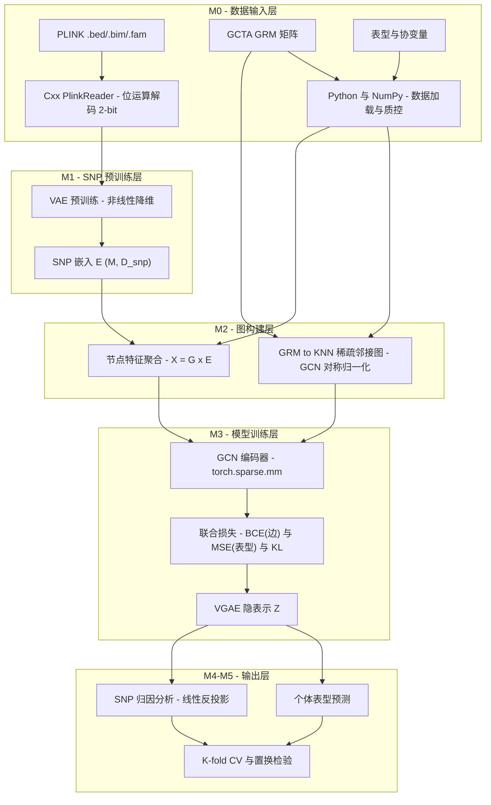

# SNP-VGAE：基于 SNP-VAE + VGAE 的基因组预测框架

SNP-VGAE 是一个两阶段深度学习框架，用于基因组表型预测。框架先通过 **SNP-VAE** 对 SNP 基因型进行无监督预训练、学习位点级低维嵌入，再基于遗传关系矩阵（GRM）构建样本 KNN 图，利用 **变分图自编码器（VGAE）** 联合优化表型预测与图结构重建，显著提升复杂性状的预测精度，并支持 SNP 级归因以解释功能位点。

## 方法概览



1. **SNP-VAE 预训练**：对基因型矩阵做无监督变分自编码，输出每个 SNP 的低维嵌入（默认 64 维），捕获非线性位点关联；采用 KL 散度预热（warmup）与早停保障收敛。
2. **样本图构建**：基于 GCTA GRM 构建 K=30 的 KNN 稀疏邻接图（同时输出归一化与原始邻接矩阵），节点为个体、边为遗传亲缘关系，节点特征由基因型与 SNP 嵌入聚合而成。
3. **VGAE 联合优化**：纯 `torch.sparse.mm` 实现的 GCN 编码器学习隐空间，MLP 预测头输出表型，边解码器配合负采样重建图结构，联合损失（MSE + BCE + KL）端到端训练。
4. **可解释性与验证**：通过编码器反投影实现 SNP 级归因；采用 5 折交叉验证 + 置换检验进行统计显著性评估，并与 PLINK GWAS 结果交叉验证。

## 项目结构

```
SNP-VGAE/
├── pytorch/src/          # Python 主体实现
│   ├── data/             # 数据层：PLINK BED/BIM/FAM、GCTA GRM、表型、协变量解析
│   │   ├── genotype.py       # BED 位运算解码，返回 (M, N) 基因型矩阵
│   │   ├── grm.py            # GCTA .grm.bin / .grm.id 读取
│   │   ├── fam.py / bim.py   # FAM / BIM 文件读取
│   │   ├── pheno.py          # 表型（.resid）读取
│   │   └── covar.py          # 协变量读取
│   ├── pretrain/         # M1：SNP-VAE 预训练与嵌入提取
│   │   ├── vae.py            # SNPVAE 模型与损失
│   │   ├── preprocess.py     # 基因型预处理与标准化
│   │   ├── train.py          # 训练流水线（KL warmup + 早停）
│   │   └── extract_embeddings.py
│   ├── graph/            # M2：样本图构建
│   │   └── build_graph.py    # GraphBuilder：KNN 图 + GCN 对称归一化 + 节点特征聚合
│   ├── model/            # M3/M4：VGAE 模型与归因
│   │   ├── gcn.py            # GCNConv（纯稀疏矩阵运算）
│   │   ├── vgae.py           # VGAEModel：编码器 + 边解码器 + 表型预测头
│   │   └── attribution.py    # SNP 级归因（编码器反投影）
│   └── train/            # M5：训练与评估流水线
│       ├── trainer.py            # VGAE 训练器
│       ├── cross_validation.py   # 5 折交叉验证
│       ├── permutation_test.py   # 置换检验
│       ├── metrics.py / plots.py # 评估指标与绘图
├── src/                  # C++ 原生扩展（PLINK 读取 / LD 计算）
├── test/                 # pytest 单测与端到端脚本
│   ├── test_pretrain.py / test_build_graph.py / test_vgae_model.py
│   ├── test_real_data.py         # SNP-VAE 真实数据端到端测试
│   ├── predict_and_attribute.py  # 预测与 SNP 归因
│   ├── snp_significance.py       # SNP 显著性判定（跨折一致性）
│   ├── gwas_vs_vgae.py           # VGAE 归因 vs PLINK GWAS 对比
│   ├── statistical_validation.py # 统计验证（置换检验汇总）
│   └── generate_figures.py       # 论文图表生成
├── test_data/            # 小鼠测试数据集（见下文）
└── pyproject.toml        # uv 管理的依赖声明
```

## 环境要求

- Python >= 3.13（由 `uv` 管理，版本见 `.python-version`）
- PyTorch >= 2.12（支持 CPU / MPS；注意 MPS 后端与部分 PyG 操作存在已知兼容性问题，默认建议 CPU 或 CUDA）
- 主要依赖：`numpy`、`scipy`、`matplotlib`、`tqdm`、`pytest`

安装依赖：

```bash
uv sync
```

## 快速开始

以 `test/test_real_data.py` 为例，对小鼠基因型数据运行 SNP-VAE 端到端流程：

```bash
# 需将 pytorch/src 加入 PYTHONPATH（模块采用顶层包导入，如 from data.genotype import ...）
export PYTHONPATH=$PWD/pytorch/src

# SNP-VAE 预训练（默认使用 test_data 中的 PLINK 数据）
uv run python test/test_real_data.py --epochs 200 --d-snp 64 --batch-size 512
```

单元测试：

```bash
export PYTHONPATH=$PWD/pytorch/src
uv run pytest test/test_pretrain.py test/test_build_graph.py test/test_vgae_model.py -v
```

## 测试数据

`test_data/` 提供小鼠（HS mice）全基因组测试数据集：

| 数据 | 文件 | 说明 |
| --- | --- | --- |
| 基因型 | `hs_mice_genome_QCed.bed/.bim/.fam` | PLINK 二进制格式，约 2002 个样本 × 9728 个 SNP |
| GRM | `total_autosome_grm.grm.bin/.grm.id/.grm.N.bin` | GCTA 格式全常染色体基因组关系矩阵 |
| 表型 | `phenotypes/*.resid` 等 | 200+ 生理/行为性状的残差化表型 |
| GWAS | `HDL_gwas.assoc.linear` | PLINK 线性回归 GWAS 结果（用于交叉验证） |

## 实验结果（feature/vgae 分支）

在小鼠群体（N ≈ 1500–1700）上，经 5 折交叉验证 + 1000 次置换检验：

- 四个性状的平均预测 R² 从 0.092 提升至 **0.149**（相对提升约 61%）；
- 置换检验 t 检验 p = 0.001，提升具有统计显著性；
- SNP 归因结果与 PLINK GWAS 显著位点交叉验证一致（Bonferroni 阈值下共 1443 个显著 SNP）。

## 分支说明

- `feature/vgae`：主开发分支（本分支），包含完整的 VGAE 训练、归因与统计验证实现；
- 功能模块开发基于 `feature/vgae` 创建独立特性分支（`feature/<模块名>`），完成后合并回 `feature/vgae`。

## 许可证

仅用于学术研究用途。

## 项目结构

```
SNP-VGAE/
├── pytorch/src/          # Python 主体实现
│   ├── data/             # 数据层：PLINK BED/BIM/FAM、GCTA GRM、表型、协变量解析
│   │   ├── genotype.py       # BED 位运算解码，返回 (M, N) 基因型矩阵
│   │   ├── grm.py            # GCTA .grm.bin / .grm.id 读取
│   │   ├── fam.py / bim.py   # FAM / BIM 文件读取
│   │   ├── pheno.py          # 表型（.resid）读取
│   │   └── covar.py          # 协变量读取
│   ├── pretrain/         # M1：SNP-VAE 预训练与嵌入提取
│   │   ├── vae.py            # SNPVAE 模型与损失
│   │   ├── preprocess.py     # 基因型预处理与标准化
│   │   ├── train.py          # 训练流水线（KL warmup + 早停）
│   │   └── extract_embeddings.py
│   ├── graph/            # M2：样本图构建
│   │   └── build_graph.py    # GraphBuilder：KNN 图 + GCN 对称归一化 + 节点特征聚合
│   ├── model/            # M3/M4：VGAE 模型与归因
│   │   ├── gcn.py            # GCNConv（纯稀疏矩阵运算）
│   │   ├── vgae.py           # VGAEModel：编码器 + 边解码器 + 表型预测头
│   │   └── attribution.py    # SNP 级归因（编码器反投影）
│   └── train/            # M5：训练与评估流水线
│       ├── trainer.py            # VGAE 训练器
│       ├── cross_validation.py   # 5 折交叉验证
│       ├── permutation_test.py   # 置换检验
│       └── metrics.py / plots.py # 评估指标与绘图
├── src/                  # C++ 原生扩展（PLINK 读取 / LD 计算）
├── test/                 # pytest 单测与端到端脚本
│   ├── test_pretrain.py / test_build_graph.py / test_vgae_model.py
│   ├── test_real_data.py         # SNP-VAE 真实数据端到端测试
│   ├── predict_and_attribute.py  # 预测与 SNP 归因
│   ├── snp_significance.py       # SNP 显著性判定（跨折一致性）
│   ├── gwas_vs_vgae.py           # VGAE 归因 vs PLINK GWAS 对比
│   ├── statistical_validation.py # 统计验证（置换检验汇总）
│   └── generate_figures.py       # 论文图表生成
├── test_data/            # 小鼠测试数据集（见下文）
└── pyproject.toml        # uv 管理的依赖声明
```

## 环境要求

- Python >= 3.13（由 `uv` 管理，版本见 `.python-version`）
- PyTorch >= 2.12（支持 CPU / MPS；注意 MPS 后端与部分 PyG 操作存在已知兼容性问题，默认建议 CPU 或 CUDA）
- 主要依赖：`numpy`、`scipy`、`matplotlib`、`tqdm`、`pytest`

安装依赖：

```bash
uv sync
```

## 快速开始

以 `test/test_real_data.py` 为例，对小鼠基因型数据运行 SNP-VAE 端到端流程：

```bash
# 需将 pytorch/src 加入 PYTHONPATH（模块采用顶层包导入，如 from data.genotype import ...）
export PYTHONPATH=$PWD/pytorch/src

# SNP-VAE 预训练（默认使用 test_data 中的 PLINK 数据）
uv run python test/test_real_data.py --epochs 200 --d-snp 64 --batch-size 512
```

单元测试：

```bash
export PYTHONPATH=$PWD/pytorch/src
uv run pytest test/test_pretrain.py test/test_build_graph.py test/test_vgae_model.py -v
```

## 测试数据

`test_data/` 提供小鼠（HS mice）全基因组测试数据集：

| 数据 | 文件 | 说明 |
| --- | --- | --- |
| 基因型 | `hs_mice_genome_QCed.bed/.bim/.fam` | PLINK 二进制格式，约 2,002 个样本 × 9,728 个 SNP |
| GRM | `total_autosome_grm.grm.bin/.grm.id/.grm.N.bin` | GCTA 格式全常染色体基因组关系矩阵 |
| 表型 | `phenotypes/*.resid` 等 | 200+ 生理/行为性状的残差化表型 |
| GWAS | `HDL_gwas.assoc.linear` | PLINK 线性回归 GWAS 结果（用于交叉验证） |

## 实验结果

在小鼠 HS 群体上，以 GCTA-BLUP 为基线，5 折交叉验证 + 置换检验评估四个性状：

| 性状 | h² | N | BLUP R² | VGAE R² | 相对提升 |
| --- | --- | --- | --- | --- | --- |
| Biochem.HDL | 0.63 | 1,509 | 0.109 | **0.218** | +100.2% |
| Biochem.ALP | 0.55 | 1,604 | 0.166 | **0.200** | +20.6% |
| End.Weight | 0.42 | 1,715 | -0.055 | **0.062** | 基线为负，提升率无定义 |
| Haem.MCV | 0.46 | 1,457 | **0.150** | 0.116 | **-22.6%（劣化）** |

统计显著性（Biochem.HDL）：5×5 重复交叉验证配对 t 检验 t = 8.36，p = 0.0011；置换检验下 BLUP 与 VGAE 的真实 R² 均显著高于零分布。

## 已知局限与缺陷（如实披露）

本框架目前的结果存在以下缺陷，解读时应注意：

1. **性状间表现不稳定**：四个性状中仅 2 个（HDL、ALP）有明确提升；End.Weight 上 BLUP 基线 R² 为负（-0.055），"提升率"指标失去意义；**Haem.MCV 上 VGAE 反而比 BLUP 低 22.6%**，说明模型对特定遗传结构的性状并不总是有效。
2. **SNP 归因与 GWAS 仅部分重合**：VGAE 归因得分与 PLINK GWAS 显著性排序的 Spearman 相关仅 ρ = 0.233；Top-50 重要 SNP 中仅 1 个与 GWAS 重合，Top-100 中 10 个，Top-500 中 175 个——两种方法对"重要位点"的判断一致性有限，归因结果的生物学解释需谨慎。
3. **置换检验规模受限**：受计算成本约束，VGAE 的置换检验仅完成 20 次（p = 0.048，接近显著性边界且分辨率低），而 BLUP 基线为 1,000 次，两者证据强度不对等。
4. **数据规模与代表性有限**：仅在单一 HS 小鼠群体上验证（N ≈ 1,457–1,715），且仅使用 QC 后的 9,728 个 SNP 子集（非全基因组密度），结论向其他群体/物种与更高密度标记的外推性未经检验。
5. **绝对预测精度仍偏低**：最优性状 R² 约 0.22，距离实际应用所需精度仍有较大差距，且结果受 K、d_z、损失权重等超参数影响（见 `test/result/figures/fig4_hyperparameter_sensitivity`）。

## 分支说明

- `feature/vgae`：**主开发分支（本分支）**，包含完整的 VGAE 训练、归因与统计验证实现；
- `main`：稳定入口分支，开发成果以 `feature/vgae` 为准；
- 功能模块开发基于 `feature/vgae` 创建独立特性分支（`feature/<模块名>`），完成后合并回 `feature/vgae`。

## 许可证

仅用于学术研究用途。
